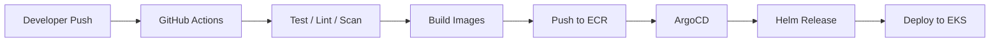

# AI-Powered Microservices Platform on AWS EKS with GitOps CI/CD

An end-to-end DevOps portfolio project that demonstrates how to design, containerize, and operate an AI-enabled microservices application with a cloud-native delivery model.

This repository combines:

- a working local microservices system
- an AI inference service
- Docker-based local development
- Kubernetes manifests for deployment
- Helm chart for release-based deployment
- blue-green deployment scaffolding
- Terraform scaffolding for AWS
- ArgoCD manifests for GitOps
- Istio service mesh scaffolding
- advanced logging stack scaffolding
- starter CI/CD workflows for GitHub Actions

## Overview

The platform simulates a production-style application where users authenticate, submit prediction requests, and receive AI-generated results through a centralized API gateway.

Current implementation status:

- local end-to-end application flow is working
- Docker Compose setup is working
- the Helm chart renders cleanly for both `dev` and `production`
- Kubernetes, ArgoCD, monitoring, logging, and Terraform are scaffolded for the next deployment phases

This makes the project suitable for:

- GitHub portfolio presentation
- DevOps coursework
- cloud-native architecture demos
- extension into a full AWS EKS deployment

## Key Features

- Microservices-based architecture
- API Gateway pattern for routing
- Authentication service with JWT
- Prediction service with persistent local history
- AI inference service with classification metadata
- React frontend dashboard
- Dockerfiles for every service
- Docker Compose local orchestration
- Kubernetes base manifests and dev/production overlays
- Helm chart for release-based deployment
- blue-green rollout direction for production releases
- ArgoCD application manifests
- Istio service mesh starter manifests
- advanced logging stack starter values
- Terraform module structure for AWS infrastructure
- cost optimization planning notes
- starter CI/CD workflows

## Architecture

### High-Level Diagram

### Delivery Flow



## Tech Stack

### Application Layer

- Frontend: React + Vite
- API Gateway: Node.js + Express
- Auth Service: Node.js + Express + JWT
- Prediction Service: Node.js + Express
- AI Inference Service: FastAPI

### DevOps Layer

- Containerization: Docker
- Local orchestration: Docker Compose
- Kubernetes manifests: Kustomize-style base and overlays
- Helm charts
- GitOps: ArgoCD
- Progressive delivery: blue-green rollout scaffold
- Service mesh: Istio
- Logging pipeline: Loki + Fluent Bit
- Infrastructure as Code: Terraform
- CI/CD: GitHub Actions

### Cloud Target

- AWS EKS
- AWS ECR
- AWS ALB
- AWS VPC
- AWS IAM
- AWS RDS
- AWS S3

## Services

| Service                | Role                                                     | Port   |
| ---------------------- | -------------------------------------------------------- | ------ |
| `frontend`             | User interface for login, prediction, stats, and history | `3000` |
| `api-gateway`          | Entry point and reverse proxy to backend services        | `4000` |
| `auth-service`         | Registration, login, token validation, user profile      | `4001` |
| `prediction-service`   | Prediction workflow, history, and statistics             | `4002` |
| `ai-inference-service` | AI inference and metadata generation                     | `8000` |

## Project Structure

```text
AI-microservices-EKS-platform/
├── docs/
├── frontend/
├── helm/
│   └── ai-platform/
├── istio/
├── api-gateway/
├── auth-service/
├── prediction-service/
├── ai-inference-service/
├── infrastructure/
│   └── terraform/
├── k8s/
│   ├── base/
│   ├── rollouts/
│   └── overlays/
│       ├── dev/
│       └── production/
├── argocd/
├── monitoring/
├── logging/
├── .github/workflows/
├── docker-compose.yml
└── README.md
```

## Local Development

### Prerequisites

- Docker Desktop
- Docker Compose

### Run the Project

```bash
cd /Users/dtam.21/Code/PersonalProject/AI-microservices-EKS-platform
cp .env.example .env
docker compose up --build
```

### Access the Application

- Frontend: `http://localhost:3000`
- API Gateway: `http://localhost:4000`
- Auth Service: `http://localhost:4001`
- Prediction Service: `http://localhost:4002`
- AI Inference Service: `http://localhost:8000`

### Demo Account

- `user@example.com` / `user123`

## Example API Flow

### 1. Login

```bash
curl -X POST http://localhost:4000/api/auth/login \
  -H "Content-Type: application/json" \
  -d '{"email":"user@example.com","password":"user123"}'
```

### 2. Create a Prediction

```bash
TOKEN=<your_token>

curl -X POST http://localhost:4000/api/predictions \
  -H "Content-Type: application/json" \
  -H "Authorization: Bearer $TOKEN" \
  -d '{"prompt":"The deployment is fast and successful"}'
```

### 3. Get Prediction History

```bash
curl http://localhost:4000/api/predictions/history \
  -H "Authorization: Bearer $TOKEN"
```

### 4. Get Prediction Stats

```bash
curl http://localhost:4000/api/predictions/stats \
  -H "Authorization: Bearer $TOKEN"
```

## Kubernetes and GitOps

The repository includes deployment scaffolding for:

- `k8s/base`: shared Kubernetes manifests
- `k8s/overlays/dev`: development environment customization
- `k8s/overlays/production`: production environment customization
- `argocd/`: ArgoCD application definitions

Planned deployment model:

```text
GitHub -> GitHub Actions -> ECR -> ArgoCD -> EKS
```

## Helm and Deployment Strategy

The repository includes a working Helm chart in:

- `helm/ai-platform`

Current Helm capabilities:

- release-scoped ConfigMap and Secret resources
- ServiceAccount support
- environment-specific values files
- PVC provisioning for `auth-service` and `prediction-service`
- HPA support for selected services
- ALB-ready ingress configuration
- production-oriented health probes and resource settings

Environment values:

- `helm/ai-platform/values-dev.yaml`
- `helm/ai-platform/values-production.yaml`

Example usage:

```bash
helm lint helm/ai-platform
helm template ai-platform helm/ai-platform -n ai-platform -f helm/ai-platform/values-dev.yaml
helm upgrade --install ai-platform helm/ai-platform -n ai-platform --create-namespace -f helm/ai-platform/values-dev.yaml
```

Planned production deployment strategy:

- use Helm for release packaging
- use ArgoCD to sync Helm-based releases
- introduce blue-green rollout for `api-gateway` and `prediction-service`
- validate preview traffic before promotion

Blue-green rollout scaffold is available in:

- `k8s/rollouts/`

## Istio Service Mesh

The repository includes starter Istio manifests in:

- `istio/gateway.yaml`
- `istio/virtualservice.yaml`
- `istio/destinationrule.yaml`

Planned Istio use cases:

- ingress traffic management
- stable/preview traffic split
- service-to-service observability
- mTLS between workloads
- progressive delivery support for blue-green or canary releases

## Terraform

Terraform is organized by modules and environments:

- `modules/network`
- `modules/eks`
- `modules/ecr`
- `modules/rds`
- `modules/s3`
- `modules/iam`
- `environments/dev`
- `environments/production`

These files are scaffolded to support a future AWS deployment and should be updated with:

- real AWS account values
- secure credentials flow
- production-ready secrets management
- environment-specific networking and IAM policies

## Monitoring and Logging

The repository includes starter configuration for:

- Prometheus + Grafana in `monitoring/`
- Loki-based logging in `logging/`
- Fluent Bit values for log collection in `logging/fluent-bit-values.yaml`

These are included as deployment scaffolds for the EKS phase.

Planned advanced logging stack:

- Fluent Bit for log collection
- Loki for aggregation
- Grafana for exploration
- retention and indexing strategy per environment

## Security Notes

Current local implementation includes:

- JWT authentication
- protected API routes
- isolated services behind an API gateway

Before production deployment, the following should be completed:

- move secrets to a proper secret manager
- replace placeholder values in Kubernetes manifests
- configure IAM least privilege
- use real persistent databases and storage backends
- enable image scanning and policy enforcement

## Cost Optimization

The repository includes cost optimization planning notes in:

- `docs/cost-optimization.md`

Target optimization areas:

- right-sized node groups
- autoscaling for services and cluster nodes
- retention control for metrics and logs
- environment-based resource limits
- Graviton adoption where compatible
- minimizing idle cost in development environments

## Roadmap

- [x] Build working local microservices flow
- [x] Containerize all services
- [x] Add Docker Compose orchestration
- [x] Add Kubernetes deployment scaffold
- [x] Add Terraform scaffold for AWS
- [x] Add ArgoCD scaffold
- [x] Add Helm chart for release-based deployment
- [x] Add environment-specific Helm values
- [x] Add PVC support for local file-backed services
- [x] Add blue-green rollout scaffold
- [x] Add Istio service mesh scaffold
- [x] Add advanced logging scaffold
- [x] Add cost optimization planning notes
- [ ] Push images to ECR
- [ ] Provision AWS infrastructure with Terraform
- [ ] Package production releases with Helm
- [ ] Deploy to EKS
- [ ] Install Istio and wire traffic management
- [ ] Implement blue-green promotion flow
- [ ] Configure ArgoCD sync
- [ ] Add observability stack on cluster
- [ ] Deploy advanced logging stack
- [ ] Apply cost optimization baselines
- [ ] Harden security for production use

## What This Project Demonstrates

- backend service decomposition
- frontend-to-microservice integration
- API gateway design
- JWT-based authentication
- containerized local development
- Kubernetes deployment structure
- GitOps-oriented repository organization
- Helm-based packaging
- blue-green deployment planning
- service mesh integration planning
- advanced logging architecture planning
- cloud cost optimization thinking
- DevOps project thinking beyond just application code

## Author Notes

This project is designed as a practical DevOps learning and portfolio repository. It focuses on showing the engineering workflow from local microservices development toward cloud-native deployment on AWS EKS.

If you are viewing this repository for evaluation, the most complete and working part at the moment is the local end-to-end application flow. The AWS EKS, Terraform, ArgoCD, monitoring, and logging sections are intentionally included as the deployment foundation for the next phase of the project.
