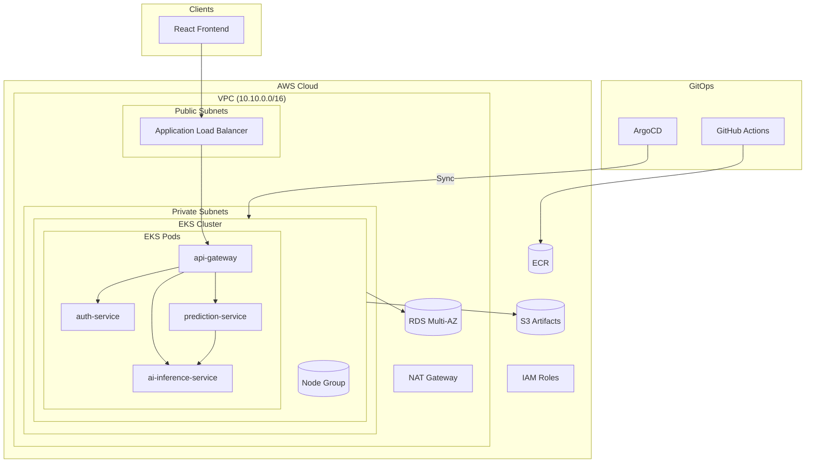
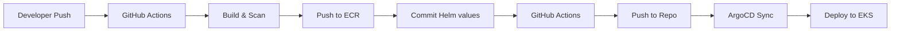

# AI-Powered Microservices Platform on AWS EKS with GitOps CI/CD

An end-to-end DevOps portfolio project that demonstrates how to design, containerize, and operate an AI-enabled microservices application with a cloud-native delivery model.

## Architecture



## Tech Stack

**Application:** React + Vite, Node.js + Express, FastAPI

**Infrastructure:** AWS EKS, AWS ECR, AWS ALB, AWS VPC, AWS RDS, AWS S3, AWS IAM

**DevOps:** Docker, Docker Compose, Kubernetes, Helm, ArgoCD, Istio, Loki + Fluent Bit, Prometheus + Grafana, Terraform, GitHub Actions

## Services

| Service | Role | Port |
|---------|------|------|
| `frontend` | User interface | `3000` |
| `api-gateway` | Entry point & reverse proxy | `4000` |
| `auth-service` | Auth, JWT, user profile | `4001` |
| `prediction-service` | Prediction workflow & history | `4002` |
| `ai-inference-service` | AI inference & metadata | `8000` |

## Quick Start — Local Development

```bash
cp .env.example .env
docker compose up --build
```

Access at `http://localhost:3000`. Demo account: `user@example.com` / `user123`

## AWS Deployment

### Prerequisites

- AWS CLI configured
- Terraform >= 1.5
- kubectl >= 1.28
- aws-iam-authenticator or eksctl

### 1. Provision Infrastructure

```bash
# Dev environment
cd infrastructure/terraform/environments/dev
terraform init
terraform plan
terraform apply

# Export kubeconfig
aws eks update-kubeconfig --name ai-platform-dev-cluster --region ap-southeast-1
```

### 2. Deploy Applications via ArgoCD

```bash
# Install ArgoCD on the cluster
kubectl apply -n argocd -f https://raw.githubusercontent.com/argocd/argocd/stable/getting-started.yaml

# Register the application
kubectl apply -f argocd/application-dev.yaml
```

### 3. Build & Push Images

```bash
# Update image tag in Helm values
sed -i "s/tag: latest/tag: $(git rev-parse --short HEAD)/g" helm/ai-platform/values.yaml
git add helm/ai-platform/values.yaml && git commit -m "chore: update image tag"

# Push triggers GitHub Actions → ECR → ArgoCD sync
git push
```

## GitOps CI/CD Flow



## Helm Deployment

```bash
# Lint
helm lint helm/ai-platform

# Render template (dry run)
helm template ai-platform helm/ai-platform -n ai-platform -f helm/ai-platform/values-dev.yaml

# Install / upgrade
helm upgrade --install ai-platform helm/ai-platform \
  -n ai-platform --create-namespace \
  -f helm/ai-platform/values-dev.yaml
```

Environment values:
- `helm/ai-platform/values-dev.yaml` — development
- `helm/ai-platform/values-production.yaml` — production

## Monitoring & Logging

| Tool | Purpose | Config |
|------|---------|--------|
| Prometheus | Metrics collection | `monitoring/prometheus-values.yaml` |
| Grafana | Metrics visualization | Included in Prometheus stack |
| Loki | Log aggregation | `logging/loki-values.yaml` |
| Fluent Bit | Log collection | `logging/fluent-bit-values.yaml` |

Deploy monitoring:
```bash
helm upgrade --install prometheus prometheus-community/kube-prometheus-stack \
  -n monitoring --create-namespace -f monitoring/prometheus-values.yaml
```

## Security Notes

- JWT authentication across all protected routes
- Services isolated behind API gateway
- IAM least-privilege via EKS node role policies
- Secrets managed via Kubernetes Secrets (production: migrate to AWS Secrets Manager)
- TLS enforced via ALB ingress
- Private subnets for all workloads

## Project Structure

```
.
├── frontend/                    # React frontend
├── api-gateway/                 # Node.js API gateway
├── auth-service/                # Authentication service
├── prediction-service/           # Prediction service
├── ai-inference-service/        # FastAPI AI service
├── infrastructure/terraform/    # AWS infrastructure
│   ├── modules/                 # Reusable Terraform modules
│   │   ├── network/             # VPC, subnets, NAT Gateway
│   │   ├── eks/                # EKS cluster & node groups
│   │   ├── rds/                # RDS PostgreSQL
│   │   ├── ecr/                # ECR repositories
│   │   ├── s3/                 # S3 buckets
│   │   └── iam/                # IAM roles
│   └── environments/            # Environment-specific configs
│       ├── dev/
│       └── production/
├── helm/ai-platform/            # Helm chart
├── k8s/                        # Kubernetes manifests
│   ├── base/                    # Shared manifests
│   ├── overlays/dev/            # Dev overlays
│   ├── overlays/production/     # Production overlays
│   └── rollouts/               # Blue-green rollouts
├── argocd/                     # ArgoCD application definitions
├── istio/                      # Istio service mesh configs
├── monitoring/                  # Prometheus + Grafana
├── logging/                    # Loki + Fluent Bit
└── .github/workflows/          # GitHub Actions CI/CD
```
